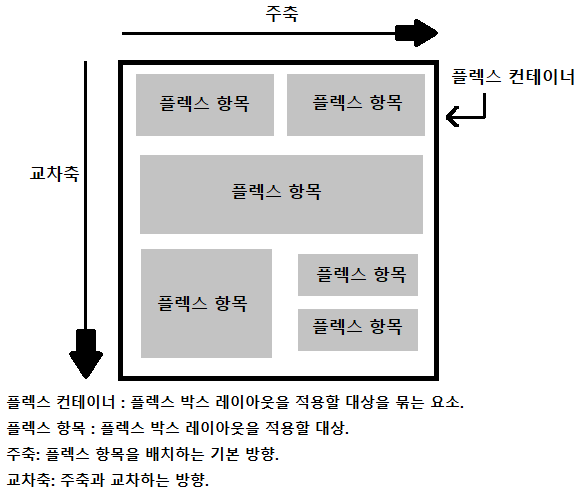
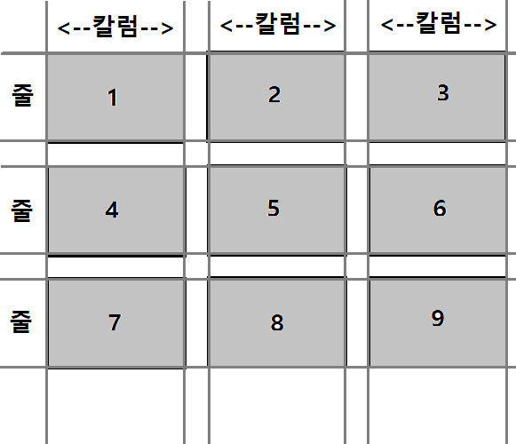

# CSS
> Do it ! HTML+CSS+자바스크립트 웹 표준의 정석 - 고경희
## 1. CSS 스타일과 스타일 시트
### 1-1. 스타일 형식
```html
ex)
선택자 { 속성: 속성값;          //   p { text-align: center;
         속성: 속성값; }        //        color : blue; }
```
<hr>

### 1-2. 스타일 시트
* 스타일 규칙을 한눈에 확인하고 수정하기 쉽도록 묶어 놓은 것.
* 스타일 시트
  * 브라우저 기본스타일
  * 사용자 스타일
   * 인라인 스타일
   * 내부 스타일 시트
   * 외부 스타일 시트
<hr>

* 브라우저 기본 스타일 : 웹 문서에서 CSS를 사용하지 않더라도 브라우저 기본 스타일을 사용함.
* 인라인 스타일 : 스타일을 적용할 대상에 직접 표시하는 방법.
```html
ex) <p style = "color:blue;"> </p>
```
* 내부 스타일 시트 : 웹 문서안에 사용할 스타일을 같은 문서안에 정리 한 것.
```html
ex) <head> 태그안에 <style> </style> 태그에 작성함.
```
* 외부 스타일 시트 : 웹 문서안에 사용할 스타일을 별도의 .css파일로 저장하고 가져와서 사용함.
```html
ex) <link rel="stylesheet" href = "파일경로">
```
### 1-3. 기본 선택자
* 전체 선택자 : 웹 브라우저의 기본 스타일을 초기화할 때 자주 사용.
```html
ex) * {속성: 값;}        // <style> * {margin:0; padding:0;} </style>
```
* 타입 선택자 : 특정 태그를 사용한 모든 요소에 스타일을 적용.
```html
ex) 태그명 {속성: 값;}     // <style> p { font-style: italic; }  </style>
```
* 클래스 선택자 : 클래스를 적용한 부분만 스타일을 적용.
```html
ex) 정의: .클래스명 { 속성: 값;}           // <style> .accent { padding: 5px; }  </style>
    사용: <선택자 class = " 클래스명 ">    // <h1 class = "accent"> 제목 </h1>
```
* id 선택자 : 특정 부분에 스타일을 적용하지만 문서에서 한 번만 적용할 수 있음.
```html
ex) 정의: #id명 { 속성: 값;}           // <style> #container { padding: 5px; }  </style>
    사용: <선택자 id = " id명 ">       // <div id = "container" > 내용 </div>
```
* 그룹 선택자 : 여러 선택자에서 같은 스타일 규칙을 사용할 경우 , 로 구분해 한번만 정의.
```html
ex) <style> h1, p { text-aling: center }; </style>
```
<hr>

### 1-4. 캐스케이딩 스타일 시트 (CSS)
* CSS에서 C는 Cascading의 줄임말이며, 스타일 시트에서 우선순위가 위에서 아래로 적용 된다는 의미.
* 스타일끼리 충돌하지 않도록 막아주는 개념이며 2가지 방법이 있다.
  * 스타일 우선순위
    * 사용자 스타일 -> 제작자 스타일 -> 브라우저 기본 스타일
    * 우선순위가 같을경우
      * !important -> 인라인 스타일 -> id스타일 -> 클래스스타일 -> 타입스타일
  * 스타일 상속
    * 태그의 자식요소에 별도로 스타일을 지정하지 않으면, 부모 요소의 스타일이 상속됨.
<hr>

## 2. 텍스트를 표현하는 스타일
### 2-1. 글꼴 관련 스타일
* font-family 속성 : 글꼴을 지정함.
```html
ex) body { font-family: "맑은 고딕", 돋움, 굴림 } 
```
* font-size 속성 : 글자 크기를 지정함.
```html
ex) body { font-size: 15px;}     // px, em, rem 단위를 사용함. 
```
* font-style 속성 : 이탤릭체로 글자를 표시함.
```html
ex) body { font-style: normal | italic | oblique } 
```
* font-weight 속성 : 글자 굵기를 지정함.
```html
ex) body { font-weight: 숫자값 | normal | bold | bolder | lighter } 
```
### 2-2. 웹 폰트
* 사용자 시스템에 없는 글꼴을 사용할 수 있다.
```html
ex) 
@font-face {
  font-family: '글꼴파일'
  src: url('파일경로')
}
```
<hr>

### 2-3. 텍스트 관련 스타일
* color 속성 : 글자색을 지정
* text-align : 텍스트 정렬
* text-decoration : 줄을 표시하거나 없애줌
* line-height : 줄 간격을 조절, 세로정렬할 때 유용함.
* text-shadow : 텍스트에 그림자 효과를 넣음. 
* text-transform : 텍스트의 대소문자 변환.
* letter-spacing : 글자 간격을 조절
* word-spacing : 글자 간격을 조절
<hr>

### 2-4. 목록 관련 스타일
* list-style-type : 불릿 모양과 번호 스타일을 지정
* list-style-image : 원하는 이미지를 사용.
* list-style-position : 리스트를 들여쓴다.
* list-style : 목록 속성을 한꺼번에 표시. 
  * 위에 3가지를 한번에 표시할 수 있다.
```html
ex)
ol{
  list-style: none; lower-alpha; inside;
}
```
<hr>

### 2-5. 표 관련 스타일
* caption-side : 표 제목의 위치를 정해줌. (top,bottom)
* border : 표에 테두리를 그려줌.
* border-spacing : 셀과 셀사이의 여백
* border-collapse : 표와 셀 테두리를 합쳐줌.
<hr>

## 3. 레이아웃을 구성하는 CSS 박스 모델
### 3-1. 블록 레벨 요소, 인라인 레벨 요소
* 블록 레벨 요소 : 태그를 사용해 요소를 삽입했을 때 혼자 한 줄을 차지하는 것.
  * ex) `<h1>`, `<div>`, `<p>`
* 인라인 레벨 요소 : 태그를 사용했을 때 한 줄을 차지하지 않는 것.
  * ex) `<span>`, ``, `<strong>`
<hr>

### 3-2. 박스 모델의 기본 구성
* 블록 레벨 요소는 모두 박스 모델 요소이다.
* 박스 모델 : 콘텐츠, border, padding, margin 등으로 구성 됨.
<hr>

### 3-3. 콘텐츠 영역의 크기 지정하기
* width 속성 : 너비를 지정
* height 속성 : 높이를 지정
<hr>

### 3-4. 박스 모델의 크기를 계산하기
* box-sizing 속성
```html
ex) 
.box1 { box-sizing: boder-box; }      // 테두리까지 포함해 너빗값을 지정.
.box2 { box-sizing: content-box; }    // 콘텐츠 영역만 너빗값을 지정.
```
<hr>

### 3-5. 박스 모델의 그림자 효과주기
* box-shadow 속성
```html
ex) 
.box1 { box-shadow: <수평거리>, <수직거리>, <흐림정도>, <번짐정도>, <색상>; }
```
<hr>

### 3-6. 테두리 스타일 지정하기
* border-style 속성: 테두리 스타일을 지정 (solid, dotted, dashed)
* border-width 속성: 테두리 두께
* border-color 속성: 테두리 색상
* border : 테두리 스타일들을 묶어서 한번에 표기할 수 있음. 
```html
ex)
#box1 { border: 3px; solid; blue; }
```
* border-radius 속성: 테두리를 둥글게 만듬.
<hr>

### 3-7. 여백 조절하기
* margin 속성: 요소 주변의 여백을 의미하며, 요소와 요소 사이의 간격을 조절 할 수 있다.
  * margin 속성과 auto값을 이용해 웹 문서를 가운데 정렬할 수 있다.
  ```html
  ex)
  #container{
    width: 600px;            // 너비값을 반드시 지정해야함.
    margin: 20px auto;       // 위아래 마진은 20, 좌우 마진은 자동.
  }
  .....
  <div id = "container">
    <h1> 제목 </h1>
  </div>
  ....
  ```
* padding 속성: 콘텐츠 영역과 테두리 사이의 여백을 의미. 
<hr>

### 3-8. 레이아웃 배치 방법
* display 속성 : 배치 방법을 결정함
  * 블록레벨 요소와 인라인레벨 요소를 바꿔 사용할 수 있다.
  * 메뉴항목을 가로로 배치할 때 많이 사용.
  * 이미지를 표 형태로 배치할 수 있음.
  * display : block             // 인라인 레벨 요소를 블록 레벨 요소로
  * display : inline            // 블록 레벨 요소를 인라인 레벨 요소로
  * display : inline-block      // 인라인,블록라인 속성 모두 가지며 마진과 패딩 지정가능.
  * display : none    
* flaot 속성 : 왼쪽이나 오른쪽으로 배치.
  * 웹 요소를 문서 위에 떠 있게 만듬.
  * 플로팅이란 요소를 왼쪽, 오른쪽에 떠 있게 만드는 레이아웃 기법.
  * `<p>` 태그는 블록레벨 요소라 이미지와 나란히 한줄에 배치 할 수 없음.
  * float 속성을 이용하면 이미지를 표시하고 그 주변에 텍스트를 둘러싸도록 할 수 있음.
  * float : left | right | none(기본값)
* clear 속성 : float 속성을 해제함.
  * float 속성을 이용하면 그 다음에 넣는 요소도 float 속성을 가지게 됨.
  * 더이상 float 속성을 사용하지 않으려면 clear 속성을 사용해야 함.
  * clear : left | right | both 
<hr>

### 3-9. 웹 요소의 위치 지정하기
* 웹 요소의 위치 지정하는 속성
  * left, right, top, bottom 속성
* position 속성의 속성 값
  * static, relative, absolute, fixed
  * position : absolute 값을 사용하려면 부모요소에 relative 값을 지정해야 함.
<hr>

## 4. 이미지와 그라데이션 효과로 배경 꾸미기
### 4-1. 배경색과 배경 범위 지정 
* background-color 속성: 배경색을 지정함.
* background-clip 속성: 배경색의 적용 범위를 조절함.
  * background-clip : border-box -> 테두리까지 적용.
  * background-clip : padding-box -> 테두리를 뺀 패딩 범위까지 적용.
  * background-clip : content-box -> 콘텐츠 부분만 적용.
<hr>

### 4-2. 배경 이미지 지정
* background-image 속성 : 웹 요소에 배경 이미지를 넣음.
```html
ex)
<style>
  body{background-image : url('경로');}
</style>
```
<hr>

### 4-3. 배경 이미지의 반복 방법 지정
* background-repeat 속성
  * background-repeat : repeat     -> 브라우저 화면에 가득 찰 때까지 가로와 세로로 반복.
  * background-repeat : repeat-x   -> 브라우저 화면너비에 가득 찰 때까지 가로로 반복.
  * background-repeat : repeat-y   -> 브라우저 화면높이에 가득 찰 때까지 세로로 반복.
  * background-repeat : no-repeat  -> 한 번만 표시호가 반복하지 않음.
</hr>

### 4-4. 배경 이미지의 위치 조절
* background-position 속성
```html
ex)
background-position : <수평위치> <수직위치> ;
수평 위치: left | center | right | <백분율> | <길이 값>
수직 위치: top | center | bottom | <백분율> | <길이 값>
```
<hr>

### 4-5. 배경 이미지의 적용 범위 조절
* background-origin 속성
  * background-origin : content-box   -> 콘텐츠 부분에만 배경 이미지를 표시.  
  * background-origin : padding-box   -> 패딩까지 배경 이미지를 표시.
  * background-origin : boder-box     -> 테두리까지 배경 이미지를 표시.
<hr>

### 4-6. 배경 이미지 고정하기
* background-attachment 속성
  * background-attachment : scroll   -> 화면을 스크롤하면 배경 이미지도 스크롤 됨.
  * background-attachment : fixed    -> 화면을 스크롤하면 배경 이미지는 고정되고 내용만 스크롤 됨.
<hr>

### 4-7. backgorund 속성 하나로 관련 속성 표기하기
```html
ex)
body{
  background : url('경로') no-repeat center bottom fixed;
}
```
<hr>

### 4-8. 배경 이미지 크기 조절하기
* background-size 속성
  * background-size : auto         -> 원래 배경 이미지만큼 표시
  * background-size : contain      -> 요소 안에 배경 이미지가 다 들어오게 확대, 축소함.
  * background-size : cover        -> 배경이미지로 요소를 모두 덮도록 이미지를 확대, 축소함.
  * background-size : <크기>       -> 이미지의 너비와 높이를 지정.
  * background-size : <백분율>     -> 요소의 크기를 기준으로 백분율을 지정.
<hr>

### 4-9. 그라데이션 효과
* linear-gradient : 선형 그라데이션
`linear-gradient( to <방향> 또는 <각도>, <색상 중지점>, <색상 중지점>, ...)`
```html
ex)
background: linear-gradient(to right bottom, blue, white);       // 왼쪽위에서 오른쪽아래 방향, 파란색에서 흰색으로. 
```
* radial-gradient : 원형 그라데이션
`radial-gradient( <모양> <크기> at <위치>, <색상 중지점>, <색상 중지점, ...>)`
```html
ex)
background: radial-gradient(circle at 20% 20%, white, blue);     // 원형 그라이데이션 20% 20% 위치, 흰색에서 파란색으로.
```
* 반복 패턴 만들기
  * repeating-linear-gradient
  * repeating-radial-gradient
<hr>

## 5. CSS 고급 선택자
### 5-1. 연결 선택자
* 둘 이상의 선택자를 연결.
* 하위 선택자
  * 부모 요소에 포함된 하위 요소를 모두 선택.
  * 자식 요소, 손자 요소 등등
  * ` section p {...} `
* 자식 선택자 
  * 자식 요소에만 스타일을 적용.
  * 손자 요소 적용 안 됨.
  * ` section > p {...} `
<hr>

* 부모 요소가 같을 경우 형제 관계라 하고, 먼저 나오는 요소를 형 요소 뒤를 동생 요소라 한다.
* 인접 형제 선택자
  * 형제 요소중 첫 번째 동생 요소만 선택하는 것.
  * ` h1 + p {...}         // h1 요소의 형제인 첫번째 p만 적용. `
* 형제 선택자
  * 형제 요소중 동생 요소를 전부 선택하는 것.
  * ` h1 ~ p {...}         // h1 요소의 형제인 모든 p를 적용.`
<hr>

### 5-2. 속성 선택자
* 태그 안에서 사용하는 속성 값에 따라 요소를 선택.
* `[속성]` 선택자
  * 특정 속성이 있는 요소를 선택.
  * ` a[href] {...}            //  a요소 중 href 속성이 있는 요소 전부 선택.`
* `[속성 = 속성값]` 선택자
  * 속성과 속성값으로만 이루어져있고, 일치하는 요소를 선택.
  * ` a[target=_blank] {...}   // a요소 중 target 속성값이 _blank 인 요소 전부 선택. `
* `[속성 ~= 속성값]` 선택자
  * 여러 속성값이 있는 요소중 해당 속성값이 있을 경우 선택.
  * 하이픈 ( - ) 로 연결한 단어는 적용되지 않음.
  * ` [calss ~= button] {...} `
* `[속성 |= 속성값]` 선택자
  * 여러 속성값이 있는 요소중 해당 속성값이 있을 경우 선택.
  * 하이픈 ( - ) 로 연결한 단어도 적용됨.
  * ` [calss |= button] {...} `
```html
ex)
<style>
  a[title |= jap] {                  //속성 값이 정확히 jap 이거나 jap- 로 시작하는 요소를 찾는 선택자
    background: url('경로')
  }
</style>
...
<ul>
  <li><a href="#" title="jap">일본</a></li>        // 속성값 = jap
```
* `[속성 ^= 속성값]` 선택자
  * 속성 값이 정확히 일치하지 않더라도 지정한 속성 값으로 시작하는 요소를 선택.
  * ` a[title ^= eng] { .... }     // 속성값이 english 일경우에도 선택 됨.
* `[속성 $= 속성값]` 선택자
  * 지정한 속성값으로 끝날 경우 선택함.
  * hwp, png, txt 등에 자주 사용.
  * ` a[href $= xls]             // 속성값이 xls로 끝나는 요소들 선택. `
```html
ex)
<style>
  a[href $= hwp] { ... }                     // href 속성 값이 hwp로 끝나는 요소 선택
</style>
...
<ul>
  <li><a href="hello.hwp"> hwp파일 </a></li>    // href 속성값이 hwp로 끝남.
</ul>
```
* `[속성 *= 속성값]` 선택자
  * 해당 속성값이 어느 위치에 있어도 지정한 속성값이 있다면 선택.
  * ` a[href *= w3] {...}            // <a href="https://www.w3.org"></a>  w3이 들어가있으므로 선택. `   
</hr>

### 5-3. 가상클래스, 가상요소
* 반응 가상 클래스 : 웹 요소를 클릭하거나 마우스 포이인터를 올려놓는 등 사용자 동작에 반응함.
* ` :link 가상클래스 선택자 ` : 방문하지 않은 링크에 스타일을 적용
* ` :visited 가상클래스 선택자 ` : 방문한 링크에 스타일을 적용
* ` :hover 가상클래스 선택자 ` : 마우스 포인터를 올려놓으면 스타일을 적용.
* ` :active 가상클래스 선택자 ` : 웹 요소를 활성화 했을 때, 즉 클릭했을 때 스타일을 적용.
* ` :focus 가상클래스 선택자 ` : 웹 요소에 포커스가 맞추어졌을 때 스타일을 적용.
* 메뉴링크에 자주 사용함.
* :link -> :visited -> :hover -> :active 순으로 정의 해야함.
```html
ex)
<style>
  a:link, a:visited { ... }         // 방문한 링크와 방문하지 않은 링크 지정
  a:hover, a:focus { ... }         // 마우스 포인터 올렸을 때, 초점을 맞췄을 때 지정
  a:active { ... }                 // 클릭했을 때 지정
</style>
...
<ul>
  <li><a href="#"> </li>
  <li><a href="#"> </li>
</ul>
```
<hr>

* 요소 상태 가상 클래스
* ` :taget 가상 클래스 선택자 ` : a (앵커)의 목적지가 되는 부분의 스타일을 적용.
* ` :enabled 와 :disabled 가상클래스 선택자 ` : 요소의 사용 여부에 따라 스타일을 적용.
* ` :checked 가상 클래스 선택자 ` : 선택한 항목에 스타일을 적용.
* ` :not 가상 클래스 선택자 ` : 선택한 항목을 제외하고 스타일을 적용.
  * 4개중 3개를 선택하고 싶을때, 선택 안된 1개로 적용하면 코드가 간결해짐.
<hr>

* 구조 가상 클래스
* 웹 문서의 구조를 기준으로 특정 위치에 있는 요소를 찾아 스타일을 적용.

| 종류 | 설명 | 
|---|:---:|
|` :only-child ` | 부모 안에 자식 요소가 하나뿐일 때 자식 요소를 선택 |
|` A:only-type-of ` | 부모 안에 A 요소가 하나뿐 일 때 선택 |
|` :first-child ` | 부모 안에 있는 모든 요소 중에서 첫 번째 자식 요소를 선택 | 
|` :last-child ` | 부모 안에 있는 모든 요소 중에서 마지막 자식 요소를 선택 | 
|` A:first-of-type ` | 부모 안에 있는 A 요소 중에서 첫 번째 요소를 선택 |
|` A:last-of-type ` | 부모 안에 있는 A 요소 중에서 마지막 요소를 선택 |
|` :nth-child(n) ` | 부모 안에 있는 모든 요소 중에서 N번째 자식 요소를 선택 |
|` :nth-last-child(n) ` | 부모 안에 있는 모든 요소 중에서 끝에서 N번째 자식 요소를 선택 |
|` A:nth-of-type(n) ` | 부모 안에 있는 A 요소 중에서 N번째 요소를 선택 |
|` A:nth-last-of-type(n) ` | 부모 안에 있는 A 요소 중에서 끝에서 N번째 요소를 선택 |
```html
ex)
<style>
  .contents :nth-child(3){              // .contents의 세번재 자식 요소에 스타일 적용
    background-color : green;
  }
  .contents p:nth-of-type(3){            // .contents의 p 요소 중에서 세번째 자식 요소에 스타일 적용
    background-color : red;
  }
</style>
...
<div class = "contents">
  <h2> 이용 안내 </h2>
  <p> Excepteur do </p>
  <p> Qui magna culpa </p>               // contents의 모든 자식요소 중 3번째 자식 요소
  <h2> 객실 소개 </h2>
  <p> Irure incididunt </p>             // contents의 p 자식 요소중 3번째
  <h2> 예약 방법 </h2>
  <p> Fugiat aliquip </p>
</div>
```
<hr>

* 가상요소
  * 문서 안의 특정 부분에 스타일을 지정하기 위해 가상으로 요소를 만들어 추가함. 
  * 화면에 보이는 부분을 꾸밀 때 불필요한 태그를 사용하지 않도록 하기 위함.
  * :: 를 사용해 표기함.
  * ` ::first-line , ::first-letter `    // 첫번째줄, 첫번째 글자에 스타일 적용
  * ` ::after, ::before `               // 지정한 요소의 내용 앞뒤에 컨텐츠를 추가할수 있음.
```html
ex)
<style>
  li.new::after{
    ...
  }
</style>
...
<ul>
  <li class="new"> </li>      // <li> 요소의 앞부분에 컨텐츠 추가
  <li> </li>
  <li> </li>
  <li class="new"> </li>      // <li> 요소의 앞부분에 컨텐츠 추가
</ul>
```
<hr>

## 6. 트랜지션과 애니메이션
### 6-1. 변형 (tarnsform)
* ex) ` transform : 함수 `
* 2차원 변형 함수
  * translate() : 웹 요소를 이동 시키는 함수
  * scale() : 웹 요소를 확대 시키는 함수
  * rotate(각도) : 웹 요소를 회전 시키는 함수
  * skew(각도) : 웹 요소를 왜곡시키는 함수
* 3차원 변형 함수
  * translate3d()
  * scaled3d()
  * rotate3d()
* perspective 속성 : 원근감을 준다.
<hr>

### 6-2. 트랜지션
* 하나의 스타일을 완전히 다른 스타일로 바꾼다.
* 자바스크립트를 사용하지 않고 애니메이션 효과를 낼 수 있다.
* 트랜지션의 속성

| 종류 | 설명 |
|---|:---:|
| transition-property | 트랜지션의 대상을 지정 |
| transition-duration | 트랜지션을 실행할 시간을 지정 |
| transition-timing-function | 트랜지션의 실행 형태를 지정 |
| transition-delay | 트랜지션의 지연 시간을 지정 |
| transition | 위 4가지 속성을 한번에 정함 |

```html
ex)
<style>
  .box {
    transition: all 2s ease-in;
  }
  .box:hover {
    width = 200px;
    height = 200px;
    background-color : red;
    transform : rotate(270deg);
  }
</style>
```
<hr>

### 6-3. 애니메이션
* 특정지점을 지정해 스타일을 바꾸면서 애니메이션을 만듬.
* 스타일이 바뀌는 지점을 키프레임이라 함.
* 키프레임은 @keyframes 속성으로 정의 함.
* 애니메이션의 속성

| 종류 | 설명 |
|---|:---:|
| @keyframes | 애니메이션이 바뀌는 지점을 지정 |
| animation-delay | 애니메이션의 시작 시간을 지정 |
| animation-direction | 애니메이션을 종료한 뒤 처음부터 시작할지, 역방향으로 진행할지 지정 |
| animation-duration | 애니메이션의 실행 시간을 지정 |
| animation-iteration-count | 애니메이션의 반복 횟수를 지정 |
| animation-name | @keyframes로 설정해놓은 중간 상태를 지정 |
| animation-timing-function | 키프레임의 전환 형태를 지정 |
| animation | 애니메이션 속성을 한꺼번에 묶어서 지정 |
 
 ```html
 ex)
<style>
  .box{
    animation-name: shpae;
    animation-duration: 3s;
    animation-timing-function: ease-in;
    animation-direction: alternate;
    animation-iteration-count: infinite;
  }                                                  // .box{ animation: shpae 3s ease-in alternate infinite; }
  @keyframes shape {
    from { border: 1px solid transparent; }
    to { 
      border: 1px solid red;
      border-radius: 50%;
    }
  }
  @keyframes background{
    from { background-color : blue; }
    50% { background-color : green; }
    to { background-color : yellow; }
  }
</style>
```
<hr>

## 7. 반응형 웹, 미디어 쿼리
### 7-1. 반응협 웹
* 반응형 웹 디자인은 웹 요소를 화면 크기에 맞게 재배치해 사이트를 구현 해줌.
* 뷰포트(viewprot) 
  * 스마트폰 화면에서 실제 내용이 표시되는 영역.
  * 모바일 기기에 적합한 사이트를 제작하기 위해 알아야 함.
  * `<meta name = "viewport" content = "속성1 = 값 1", "속성2 = 값 2", ... >`
    * 속성 : width, height, user-scalable, initial-scale
  * 가장 많이 사용하는 뷰포트 방법
    * 웹페이지 뷰포트의 너비를 스마트폰 화면 너비에 맞추고 초기 화면 배율을 1로 지정
    * `<meta name = "viewport" content = "width=device-width, initial-scale=1">`
  * 뷰포트 단위
    * vw : 1vw 는 뷰포트 너비의 1% 와 같음
    * vh : 1vh 는 뷰포트 높이의 1% 와 같음
    * vmin : 뷰포트의 너비와 높이 중에서 작은 값의 1% 와 같음
    * vmax : 뷰포트의 너비와 높이 중에서 큰 값의 1% 와 같음
<hr>

### 7-2. 미디어 쿼리
* 사이트에 접속하는 장치에 따라 특정한 CSS 스타일을 사용하는 방법.
* 접속하는 기기의 화면 크기에 따라 레이아웃이 달라짐.
* 미디이 쿼리 구문
  * ` @media [only|not] 미디어유형 and (조건) and (조건) ... { } `
  * only : 미디어 쿼리를 지원하지 않는 웹에서는 미디어 쿼리를 무시하고 실행하지 않음.
  * not : not 다음에 나오는 미디어 유형을 제외하고 적용함.
  * and : 조건을 여러개 연결해서 추가할 수 있음.
  * 미디어유형 : all, print, screen, tv 등등
  * ` @media screen and (min-width: 768px) and (max-width: 1439px) { ... } `  // 너비가 768px ~ 1439px인 화면용 스타일
<hr>

* 웹 문서의 가로 너비와 세로 높이 속성
  * width, height : 웹 페이지의 가로 너비, 세로 높이를 지정
  * min-width, min-height : 웹 페이지의 최소 너비, 최소 높이를 지정
  * max-width, max-height : 웹 페이지의 최대 너비, 최대 높이를 지정
  * ` @media screen and (min-width: 1440px) `
* 단말기의 가로 너비와 세로 높이 속성
  * device-width, device-height : 단말기의 가로 너비, 세로 높이를 지정
  * min-device-width, min-device-height : 단말기의 최소 너비, 최소 높이를 지정
  * max-device-width, max-device-height : 단말기의 최대 너비, 최대 높이를 지정
  * ` @medai screen and (min-device-width: 375px) and (min-device-height: 812px){ ... }`
* 화면 회전 속성
  * orientation: portrait    -> 단말기가 세로 모드일 경우
  * orientation: landscape   -> 단말기가 가로 모드일 경우
  * ` @media screen and (orientation: landscape) and (min-device-width: 812px) { ... } `
* 미디어 쿼리의 중단점
  * 미디어 쿼리로 서로 다른 CSS를 적용하는 분기점을 중단점이라 함.
  * 보통 중단점은 모바일, 태블릿, 데스크톱으로 구분함.
  * 모바이 퍼스트 기법
    * 모바일의 레이아웃을 기본으로 CSS를 만들고 뒤에 데스크톱에 맞춰 기능과 스타일을 추가하는 것.
<hr>

### 7-3. 미디어 쿼리 적용하기
* 방법1 : 외부 CSS 파일로 연결하기.
  * ` <link rel = "stylesheet" media = "미디어 쿼리 조건" href = "적용할 css파일 경로"> `
  * `<head>` 태그 사이에 입력하며 의미는 미디어 쿼리 조건이 맞다면 지정한 파일을 가져와 연결하란 것.
  * ex) ` <link rel = "stylesheet" media = "print" href = "css/print.css"> `
* 방법2 : 웹 문서에 직접 정의하기.
  * `<style>` 태그 안에서 조건을 지정하고 스타일 규칙을 정의
    * ` <style media = "조건" >  {...스타일 규칙}  </style> `
  * `@media` 문을 사용해 스타일 조건을 지정하고 스타일을 규칙을 정의
    * ` <style>  media 조건 {...스타일 규칙}  </style> `
<hr>

### 7-4. 그리드 레이아웃
* 화면을 규칙적으로 배열해 사이트 전체 디자인이나 일관성을 유지 시켜줌.
* 웹 사이트를 여러개의 칼럼으로 나눈후 메뉴, 본문, 이미지등 요소를 화면에 맞게 배치하는 것.
* 특징 
  * 시각적으로 안정된 디자인
  * 업데이트가 편한 웹 디자인을 구성
  * 요소를 자유롭게 배치
* 방법: 플렉서블 박스 레이아웃, CSS 그리드 레이아웃.
  * 플렉서블 박스 레이아웃 (=플렉스 박스 레이아웃)
   * 각 박스를 원하는 위치에 따라 배치 하는 것.
   * 수평방향, 수직방향 중 한쪽을 주축으로 박스를 배치.
   * 수평방향일 경우 박스를 왼쪽에서 오른쪽으로 순서대로 배치.
   * 화면 너비를 넘어 갈 경우 수직으로 내려가 다시 순서대로 배치.
  * CSS 그리드 레이아웃
   * 수평과 수직 어느 방향이든 배치할 수 있음.
   * 레고 블록을 끼워 맞추듯 요소를 배치.
<hr>

### 7-5. 플렉스 박스 레이아웃

* 플렉스 컨테이너 지정하기.
  * 먼저 레이아웃을 적용할 컨텐츠를 플렉스 컨테이너로 묶어 주어야 함.
  * display: flex 속성          --> 플렉스 항목을 블록 레벨 요소로 배치.
  * display: inline-flex 속성   --> 플렉스 항목을 인라인 레벨 요소로 배치.
* 플렉스 박스의 배치방향 지정하기.
  * flex-direction : row 속성               --> 주축:가로, 왼쪽에서 오른쪽 (기본값)
  * flex-direction : row-reverse 속성       --> 주축:가로, 오른쪽에서 왼쪽
  * flex-direction : column 속성            --> 주축:세로, 위에서 아래
  * flex-direction : column-reverse 속성    --> 주축:세로, 아래에서 위로
* 플렉스 박스의 줄 바꾸기.
  * 플렉스 컨테이너 너비보다 많은 플렉스 박스들이 있을 경우 줄을 바꿀지 지정.
  * flex-wrap: nowrap 속성           --> 플렉스 박스를 한줄에 표시. (기본값)
  * flex-wrap: wrap 속성             --> 플렉스 박스를 여러 줄에 표시. 
  * flex-wrap: wrap-reverse 속성     --> 플렉스 박스를 여러줄에 표시하되, 시작점과 끝점이 바뀜.
* 플렉스 박스의 배치방향, 줄바꿈 한꺼번에 지정하기
  * flex-flow 속성

```html
ex)
<style>
  .container { display: flex;}            // 플렉스 컨테이너 지정
  #box1 {
    flex-direction: row;
    flex-wrap: nowrap;
  }
  #box2 {
    flex-flow: column wrap; 
  }
</style>
```
<hr>

* 플렉스 박스 정렬 방법
  * justify-content 속성 : 주축 방향의 정렬 방법
    * justify-content: flex-start        --> 주축의 시작점에 맞춰 배치.
    * justify-content: flex-end          --> 주축의 끝점에 맞춰 배치.
    * justify-content: center            --> 주축의 중앙에 맞춰 배치.
    * justify-content: space-around      --> 모든 항목을 주축에 같은 간격으로 배치.
  * align-items 속성 : 교차축 방향의 정렬 방법
    * align-items: flex-start            --> 교차축의 시작점에 맞춰 배치.
    * align-items: flex-end              --> 교차축의 끝점에 맞춰 배치
    * align-items: center                --> 교차축의 중앙에 배치.
    * align-items: baseline              --> 교차축의 문자 기준선에 맞춰 배치.
    * align-items: stretch               --> 플렉스 항목을 늘려 교차축에 가득차게 배치.
  * align-self 속성 : 교차축에서 특정 항목만 정렬 방법을 지정.
    * 속성 값은 align-itesm 와 같음
  * align-content 속성 : 교차축에서 여러 줄로 표시된 항목의 정렬 방법
    * 속성 값은 align-itesm 와 같음
* 플렉스 레이아웃을 활용해 화면 중앙에 배치하기.
```html
ex)
<style>
  * { margin: 0; box-sizing: border-box;}
  body{
    background: url('경로') no-repeat left top fixed;
    background-size: cover;
    display: flex;                     // 플렉스 컨테이너 지정
    justify-content: center;           // 주축의 중앙에 배치
    align-items: center;               // 교차축의 중앙에 배치.
    min-height: 100vh;                 // 이미지 높이가 100vh 이하로 작아지지 않음.
  }
</style>
```
<hr>

### 7-6. CSS 그리드 레이아웃
* 플렉스 레이아웃은 가로, 세로 중 하나를 주축으로 사용. 1차원.
* CSS 그리드 레이아웃은 가로와 세로를 모두 사용. 2차원.
* 줄(row): 가로방향, 칼럼(column): 세로방향으로 웹 화면을 구성.


* 그리드 컨테이너 지정하기.
  * 먼저 레이아웃을 적용할 컨텐츠를 플렉스 컨테이너로 묶어 주어야 함.
  * display: gird 속성              --> 컨테이너 안의 항목을 블록 레벨 요소로 배치.
  * display: inline-grid 속성       --> 컨테이너 안의 항목을 인라인 레벨 요소로 배치.
* 줄과 칼람의 크기와 개수 지정하기.
  * gird-template-rows 속성         --> 줄의 개수와 너비 지정.
  * grid-template-columns 속성      --> 칼럼의 개수와 높이 지정.
    * 그리드 레이아웃에서는 상대적인 크기를 지정할 수 있는 fr 단위를 사용.
    * ex) ` grid-template-columns: 1fr 1fr 1fr; `
    * 값이 반복 될 때 줄여서 표현할 수 있는 repate() 함수 사용.
    * ex) ` grid-template-columns: repeat(3, 1fr); `
* 그리드 항목의 간격을 지정하기.
  * grid-column-gap 속성      --> 칼럼과 칼럼 사이의 간격을 지정.
  * grid-row-gap 속성         --> 줄고 줄 사이의 간격을 지정.
  * grid-gap 속성             --> 칼럼과 줄 사이의 간격을 한꺼번에 지정.
<hr>

* 그리드 라인을 이용해 그리드 항목 배치하기.

| 속성 | 설명 | 예시 |
|---|:---:|---|
| grid-column-start | 칼럼 시작의 라인 번호를 지정. | grid-column-start: 1 |
| grid-column-end | 칼럼 마지막의 라인 번호를 지정. | grid-column-end: 4 |
| grid-column | 칼럼 시작번호, 칼럼 끝번호 사이에 / 를 넣어 사용. | grid-column: 1/4 |
| grid-row-start | 줄 시작의 라인 번호를 지정. | grid-row-start: 2 |
| grid-row-end | 줄 마지막의 라인 번호를 지정. | grid-row-end: 4 |
| grid-row | 줄 시작번호, 줄 끝번호 사이에 / 를 넣어 사용. | grid-row: 2/4 |

* 템플릿 영역을 만들어 항목  배치하기.
  * gird-area 속성                --> 각 영역에 템플릿 이름 지정.
  * grid-template-areas 속성      --> 템플릿 영역을 어떻게 배치할지 지정.

```html
ex)
<style>
  .box1{
    background-color: red;
    grid-area: box1;                    // 이름 지정.
  }
  .box2{
    background-color: blue;
    grid-area: bo2;                     // 이름 지정.
  }
  ...
  #wrapper{
    width = 700px;
    display: grid;
    grid-template-columns: repeat(3, 1fr);
    grid-template-rows: repeat(3, 100px);
    grid-template-areas:
      "box1 box1 box1"                   // 한 줄에 들어갈 템플릿 영역을 큰따옴표로 묶음.
      "box2 box3 box3"
      "box2 . box4";                    // 빈 영역은 마침표를 넣음.
  }
</style>
```

